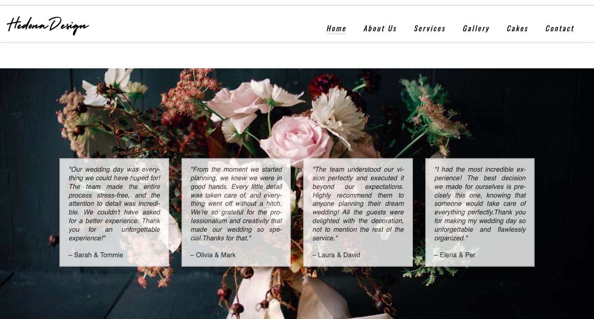

# Hedona Design-wedding planning, design and floral 

Hedona Design is a website dedicated to providing wedding planning, coordination, and floral arrangement services. The site aims to help couples create unforgettable moments with personal and intimate wedding experiences. The website features detailed information about services, a gallery of previous work, and an easy booking system for consultations.

## Features 

+ **Navigation Bar**

  + Present on all pages, the fully responsive navigation bar includes links to the Home page, About Us section, Services page, Gallery, Cakes, and Contact page.

  + Includes a dropdown menu for mobile navigation.

  + Ensures seamless navigation across all devices.

+ **Home page**
 
  + Provides an overview of Hedona Design with an engaging hero section.

  + Features a call-to-action (CTA) button for booking a consultation.

  + Includes a prominent banner image with a brand message.

+ **About Us Section**

  + Introduces the team and philosophy behind Hedona Design.

  + Showcases the brand’s mission and dedication to crafting memorable wedding experiences.

  + Features an image collage of wedding designs and services.

+ **Services Section**  

  + Details wedding services such as cake design, floral arrangements, and event planning.

  + Each section is complemented with images and descriptions.

  + Introduces a structured service breakdown: Cakes, Design & Flowers, and Coordination.

+ **Gallery Page**

  + Displays a portfolio of previous wedding projects.

  + Uses an interactive grid layout that enlarges images on hover.

  + Features high-resolution images from past weddings.

+ **Cakes Section**

  + Highlights custom wedding cakes created by Hedona Design.

  + Features an image carousel of cake designs.

  + Includes close-up visuals of handcrafted cakes and intricate details.

+ **Contact Page**

  + Includes a contact form for inquiries and booking.

  + Features an interactive Google Map displaying the business location.

  + Allows users to book an appointment with an integrated date and time selector.

+ **Thank You Page**

  + Includes a confirmation of submitted form and button to home page.

+ **Reviews Section**

  + Displays testimonials from satisfied clients in an engaging layout.

  + Contains a dynamic sliding review section.

 

+ **Prefooter Section**

  + Displays the inspiration for the logo name.

+ **Footer Section**

  + The section also includes a Facebook, Pinterest and Instagram social link that will open up in a new tab for easy navigation.

  + The section also includes the phone number of Hedona Design company, mail and city location.

### Features Left to Implement

  + Add a detailed blog section with wedding planning tips and inspiration.

  + Implement an online booking calendar for real-time scheduling.

  + Include an FAQ section for common inquiries.

## Testing 

### Manual testing

#### Navigation and link testing
  + The Hedona Design wedding planning website was manually tested to ensure all visual, functional, and responsive features work as expected across different browsers and devices.
  + Verified that all navigation links direct users to the correct pages.
  + Tested the navigation bar, buttons, and social media icons to confirm they link to there respective pages.
  + Confirm all links and buttons are functioning
  + Validate layout and styling consistency on various screen sizes
  + Ensure all images, text content, and sections load correctly
  + Test responsiveness of the navigation menu and image galleries
  + Evaluate mobile, tablet, and desktop user experience

  Index.html page

1. 🧭 Navigation Menu
Component: Header menu (Home, About Us, Services, Cake Gallery, Reviews, Contact)

Test Steps:

Click each navigation link on desktop.

Resize to mobile view and open hamburger menu.

Tap each item in the mobile menu.

Expected Result: Navigation scrolls to correct section smoothly. Mobile menu expands/collapses and functions correctly.

Actual Result: ✔ Navigation is smooth and functional on all screen sizes.

Status: ✅ Pass

2. 🏠 Hero Section
Component: Hero area (headline, subheadline, background image)

Test Steps:

Load the homepage.

Check visibility and legibility of headline and subheadline.

Check if background image loads correctly.

Expected Result: Text is clear and overlays the image correctly; image loads without distortion.

Actual Result: ✔ Background and text render perfectly across screen sizes.

Status: ✅ Pass

3. 👩‍❤️‍👨 About Us Section
Component: “About Us” text and image

Test Steps:

Scroll to About Us.

Check alignment of text and accompanying image.

Test mobile responsiveness.

Expected Result: Content is centered or left-aligned depending on screen size, images don’t overflow or pixelate.

Actual Result: ✔ Layout adjusts seamlessly from desktop to mobile.

Status: ✅ Pass

4. 🍰 Our Services
Component: Services cards (Cake Design, Wedding Coordination, Styling)

Test Steps:

Verify each card has a heading, image, and description.

Check hover effects and spacing between cards.

Resize to test mobile stacking.

Expected Result: Cards are visually consistent, accessible on all screen sizes, and stack vertically on mobile.

Actual Result: ✔ All elements function and display as expected.

Status: ✅ Pass

5. 🎂 Cake Gallery
Component: Cake gallery image grid

Test Steps:

Scroll to gallery section.

Ensure all images load and are not broken.

Resize window to test responsiveness.

Expected Result: Gallery maintains a grid layout, images scale correctly, no broken image links.

Actual Result: ✔ Layout remains intact on all devices.

Status: ✅ Pass

6. 💬 Client Reviews
Component: Reviews/testimonials

Test Steps:

Scroll to review section.

Confirm each review is readable and properly formatted.

Resize to mobile view.

Expected Result: Reviews appear as cards with uniform styling and do not overlap.

Actual Result: ✔ All reviews display properly, no formatting issues.

Status: ✅ Pass

7. 📱 Mobile Responsiveness
Component: Entire site (menu, sections, footer)

Test Steps:

Test using developer tools and actual devices.

Simulate screen widths (320px to 1440px).

Tap interactive elements.

Expected Result: No horizontal scrolling, tap targets are accessible, text is legible, and layout adapts.

Actual Result: ✔ Responsive across tested breakpoints and devices.

Status: ✅ Pass

8. 📎 Pre-Footer: "Behind the Name"
Component: Story block before footer

Test Steps:

Read story content.

Check formatting, font style, and text alignment.

Expected Result: Story is readable, formatting is visually appealing, especially on smaller screens.

Actual Result: ✔ Clear content and visually distinct section.

Status: ✅ Pass

9. 🔗 Footer & Social Icons
Component: Facebook icon and footer links

Test Steps:

Click Facebook icon.

Observe hover effect.

Confirm icon opens the correct page in new tab.

Expected Result: Facebook link opens in new tab. Hover effect applied. Icon visible on all screen sizes.

Actual Result: ✔ Functionality and styling confirmed.

Status: ✅ Pass

10. 🌐 SEO & Metadata
Component: HTML <head> section

Test Steps:

View page source.

Locate <meta name="description">, <meta name="keywords">, and favicon link.

Expected Result: Metadata present and relevant to wedding services. Favicon displays on browser tab.

Actual Result: ✔ Metadata and favicon verified.

Status: ✅ Pass

11. 🚫 404 Handling
Component: URL routing

Test Steps:

Type a non-existent route (e.g. /cake-toppers).

Expected Result: Browser shows a default 404 error since no custom routing is set.

Actual Result: ✔ Standard browser error page shown.

Status: ✅ Pass

Manual testing was performed on the gallery.html page to ensure all key features work correctly and the user experience is smooth across devices and browsers. The following areas were carefully tested:

✅ Page Load & Structure
The gallery page was manually opened in multiple browsers (Chrome, Firefox, Safari, Edge) and on both desktop and mobile devices. The page loaded successfully each time without any broken layout or missing content. All CSS styles were applied correctly, and no 404 errors were found in the developer tools' network tab.

✅ Navigation Bar & Header
The navigation bar was tested to confirm that all links function correctly. Clicking the logo redirects the user back to the homepage (index.html). On mobile view, the hamburger menu (☰) opens and collapses the navigation as expected. The currently active page (Gallery) is visually highlighted to help users know where they are on the website. All links such as “About Us,” “Services,” “Cakes,” and “Contact” direct the user to their respective pages or sections.

✅ Gallery Functionality
The main gallery section was carefully reviewed. Each image displayed properly, and no broken image links were encountered. The gallery contained 16 images, each with meaningful alternative text (alt) for accessibility purposes. The images represent various wedding decorations, themes, and styling ideas in line with the website’s wedding planning service.

On smaller screens (such as mobile phones), the gallery adjusted to fit the width of the device, ensuring a responsive and visually clean display. Users could scroll vertically to browse all images comfortably without horizontal scrolling.

✅ Footer & Contact Information
The footer includes links to Hedona Design's social media pages (Facebook, Instagram, Pinterest). Each link was tested and opened the correct platform in a new browser tab. The aria-label attributes were also present on these links, ensuring screen reader accessibility.

Additionally, the contact information section displays the company name, phone number, email address, and location (Gothenburg, Sweden), all of which were checked for readability and formatting.

✅ Favicon and Meta Tags
The favicon appeared correctly in the browser tab, enhancing the branding experience. The meta description and keywords in the HTML head were verified to be present and appropriate for SEO, reflecting keywords like "weddings," "wedding planner," and "Sweden."

✅ Responsiveness Testing
Manual resizing of the browser window confirmed that the page layout responds smoothly to various screen sizes, including mobile, tablet, and desktop. No content overlapped or overflowed off the screen. The header and navigation adapted as expected, and images resized without distortion.

✅ Accessibility Review
Basic accessibility checks were completed manually. All images included descriptive alt attributes, keyboard navigation was supported (e.g., users could tab through links), and semantic HTML elements like <header>, <nav>, <main>, and <footer> were used appropriately. Texts had sufficient contrast against their backgrounds to ensure readability.

✅ Browser Compatibility
The site was tested on the latest versions of Chrome, Firefox, Safari, and Edge, as well as on mobile browsers like Chrome (Android) and Safari (iOS). All elements, styles, images, and interactive features rendered and functioned correctly across platforms.

✅ Final Notes
No critical issues were found during manual testing. The gallery page of the Hedona Design website functions correctly, loads reliably, presents content clearly, and provides a user-friendly and responsive experience on all tested devices and browsers.

Comprehensive manual testing was conducted on the contact.html page of the Hedona Design website to ensure functionality, usability, and accessibility across different devices and browsers. Here's a breakdown of the key areas tested:

✅ Page Load & Visual Elements
The contact page was opened in Chrome, Firefox, Safari, and Edge, as well as on mobile browsers. The page consistently loaded without delay, displaying the hero image, navigation, contact form, and footer without any layout issues or missing elements. The visual design remained consistent with the rest of the site, maintaining brand colors, fonts, and spacing.

✅ Navigation Bar
The header navigation was fully functional. All links worked correctly, with the “Contact” link highlighted to indicate the current page. On mobile view, the burger menu (☰) toggled as expected, allowing users to expand and collapse the navigation. The Hedona Design logo linked correctly back to the homepage (index.html).

✅ Contact Form Functionality
The form was tested for correct field behavior and input validation. All required fields—first name, last name, email, event date/time, guest count, and message—prompted an error if left empty. The email field required a valid format, and the datetime picker respected the min and max range set for the year 2025. Upon submission, the form redirected users to thank-you.html, confirming successful interaction.

Placeholder text and labels provided clarity for each input field, and fields retained their layout and alignment across screen sizes. The layout gracefully adapted on mobile devices, ensuring that the form remained readable and easy to fill out with touch input.

✅ Footer & External Links
The footer was tested to ensure visibility and link functionality. All three social media icons (Facebook, Instagram, Pinterest) opened the correct pages in a new tab. The aria-label attributes were verified to enhance screen reader accessibility. Contact information, including phone number, email, and location (Gothenburg, Sweden), was clearly visible and well-formatted.

✅ Accessibility & Semantic Structure
All form elements were properly labeled using <label for=""> attributes to support screen readers. Semantic HTML was used throughout the page (<header>, <nav>, <main>, <footer>), contributing to overall accessibility and SEO. Basic keyboard navigation was tested, confirming that users could navigate the page and form fields using only the keyboard.

✅ Favicon and Meta Tags
The favicon displayed correctly in browser tabs. Meta tags for description and keywords were present and relevant, supporting SEO for search engines targeting wedding planning and decoration in Sweden.

✅ Responsiveness Testing
Responsive behavior was confirmed by resizing the browser window and testing on multiple devices. The form fields stacked vertically on smaller screens, remaining user-friendly and legible. No horizontal scrolling or overlapping content was observed.

✅ Final Notes
No issues were detected during manual testing. The contact page performs reliably, offers a smooth and accessible user experience, and is consistent in appearance and functionality across all tested platforms. The contact form is intuitive and responsive, contributing to a professional and engaging user journey.

🧪 Manual Testing – Thank You Page
Manual testing was performed on the thank-you.html page to ensure it delivers a smooth, accessible, and visually pleasing confirmation experience following form submission.

✅ Page Load & Display
The page loaded instantly across all tested browsers, including Chrome, Firefox, Safari, and Microsoft Edge, both on desktop and mobile devices. The message “Thank you! Your form has been submitted.” was clearly centered on the screen and styled appropriately with a bold font and a friendly tone.

✅ Design & Readability
The use of a large, readable font combined with centered alignment and generous padding created a positive user experience. The soft color palette—gray text and a vibrant coral button—offered visual appeal while maintaining contrast for readability. The responsive design scaled well on smaller screens without requiring horizontal scrolling or zooming.

✅ Button Functionality
The "Go back to Home page" button was tested and worked correctly, redirecting users back to index.html. The hover effect on the button was visually responsive, changing the background to a soft yellow (#f7d9a1) to indicate interactivity, which improved user feedback.

✅ Accessibility
The page uses semantic HTML elements, including 
 and <a>, and the structure was clean and screen-reader-friendly. Tab navigation using a keyboard successfully highlighted the return button, making the page accessible for users who rely on keyboard input.

✅ No Broken Links or Errors
The return link worked across all platforms, and no 404 errors or missing resources occurred during testing. No JavaScript or external libraries were used, reducing the potential for conflicts or errors.

✅ Final Notes
The thank-you.html page effectively confirms form submission with clarity, accessibility, and responsive design. The simple yet elegant layout reinforces user trust and provides a smooth transition back to the homepage. No issues were identified during manual testing.

#### Responsiveness testing

  + Ensured all webpages adapt properly to different screen width.
  + The website has been tested on desktop, laptop and iPad Pro, Samsung Galaxy S8+ and is responsive.

#### Hover effects and User interaction
##### Checked hover effects on:

+ Navigation bar
+ Icons
+ Buttons
+ Social media links

#### Form Validation and Redirection

+ Tested the booking form to confirm that:
   + Redirect users to the correct successpage after submission.
   + Display validation messages when required fields are left empty.
   + Prevent submission of inputs containing only whitespace.

### Automated testing

   + Lighthouse Performance Testing
   + The website has been tested using Lighthouse, achieving high accessibility and performance scores.

  

### General Testing

   + I tested it in different browsers Safari, Google Chrome.
   + All the website's sections are readable and easy to understand.

   + External links are set to **open in a new tab** to avoid losing the user’s place on the website.

## Technology

  + HTML
  + CSS
  + Gitpod
  + Github
  + Visual Studio

### Validator Testing 

  + HTML
    + No errors were returned when passing through the official W3C validator.
  + CSS
    + No errors were found when passing through the official (Jigsaw) validator.

### Unfixed Bugs

  + Fixed minor form submission issues before deployment.

  + Addressed layout inconsistencies on mobile devices.

## Deployment

  + This section should describe the process you went through to deploy the project to a hosting platform (e.g. GitHub) 

  + The site was deployed to GitHub pages. The steps to deploy are as follows: 
  + In the GitHub repository, navigate to the Settings tab, and then to Pages in Code and automation.
  + From the Deoploy and Branch source I chose Main branch and set folder to Root.
  + Once the main branch has been selected, the page will be automatically refreshed with a detailed ribbon display to indicate the successful deployment. 

  + The live link can be found here - https://naida1710.github.io/HDesign/

## Credits 

+ Content

  + All icons are from Font Awesome

+ Media

  + Images Unsplash
  + Some images have been taken by me

### Content 

  + All icons are from Font Awesome.
  +  The browser tab logo is from Favicon.

### Media

  + Images Unsplash.
  + Some images have been taken by me.

